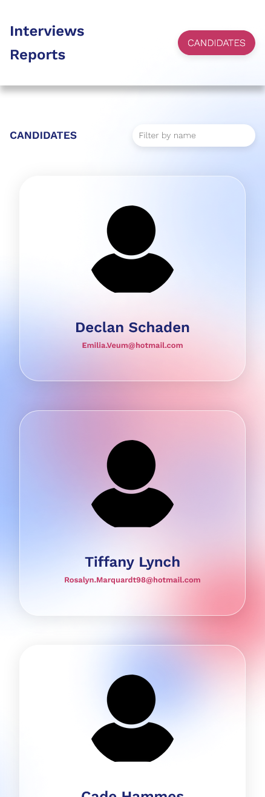
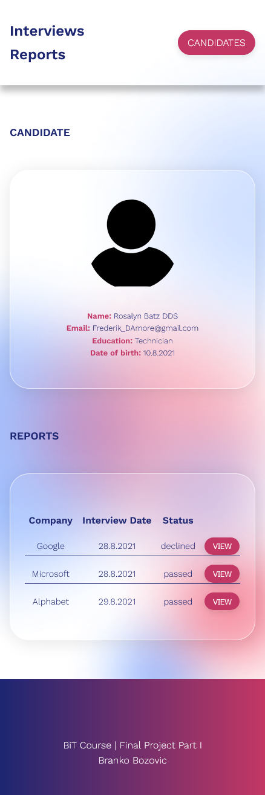
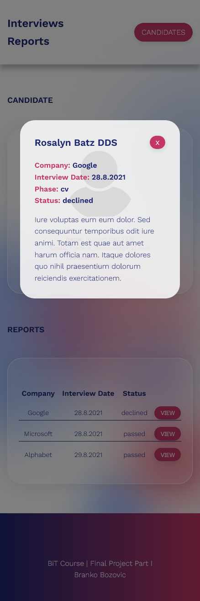
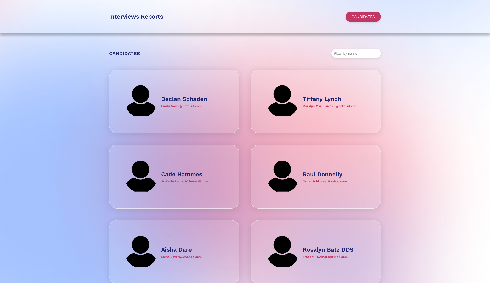
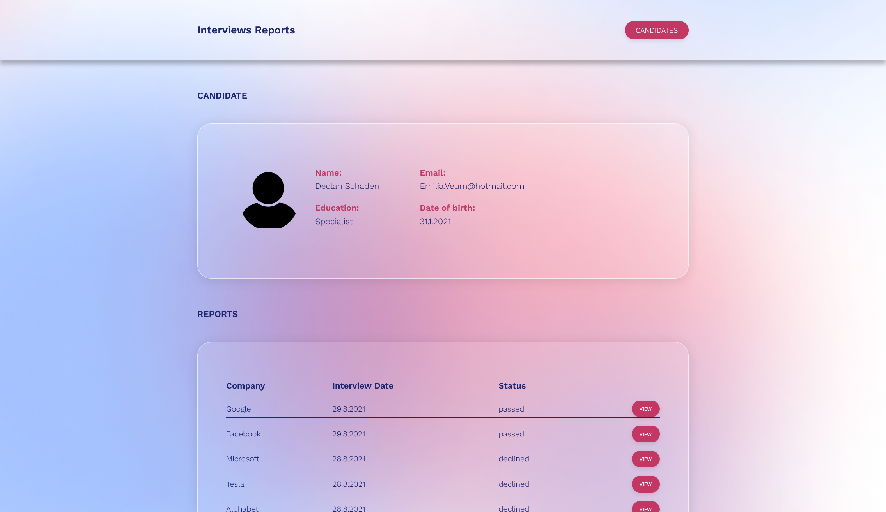
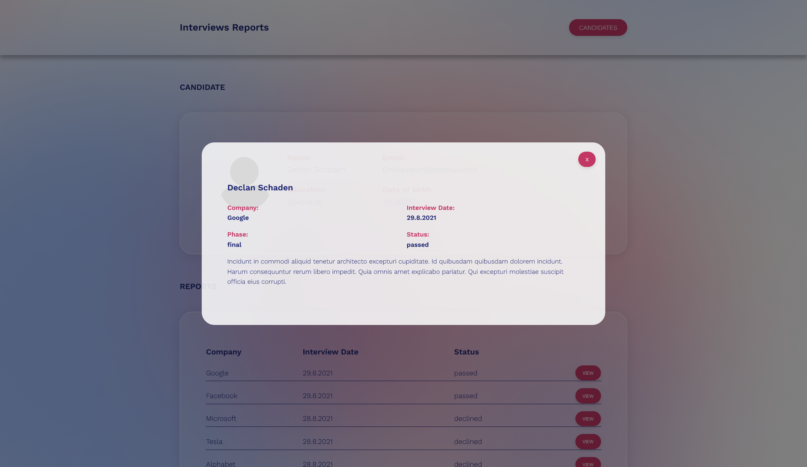

# Interview Reports - Part I

BIT Frontend Bootcamp Final Project - Web app system for tracking job interviews.

## Project

Project is divided into two sections.

- This is first one - UI for viewing already existing candidates and reports which are created for those candidates.

Public web application should consist of:

- List of Candidates (landing page)
  - Candidates will appear in cards layout
  - List of Candidates can be filtered by Candidate Name
  - For each Candidate, Name, Avatar and Email should be shown
- Candidate Reports Page
  - All details about the Candidate should be shown
    - Name
    - Avatar
    - Email
    - Education
  - List of all Reports related to the selected Candidate should be shown including
    - Company
    - Interview Date
    - Status
  - User should be able to select a Report from the list in order to see a full Report
    - Report details should be shown in Modal Dialog

## Tools

- ReactJS
- Semantic HTML5 markup
- SCSS
- BEM

## Screenshots

